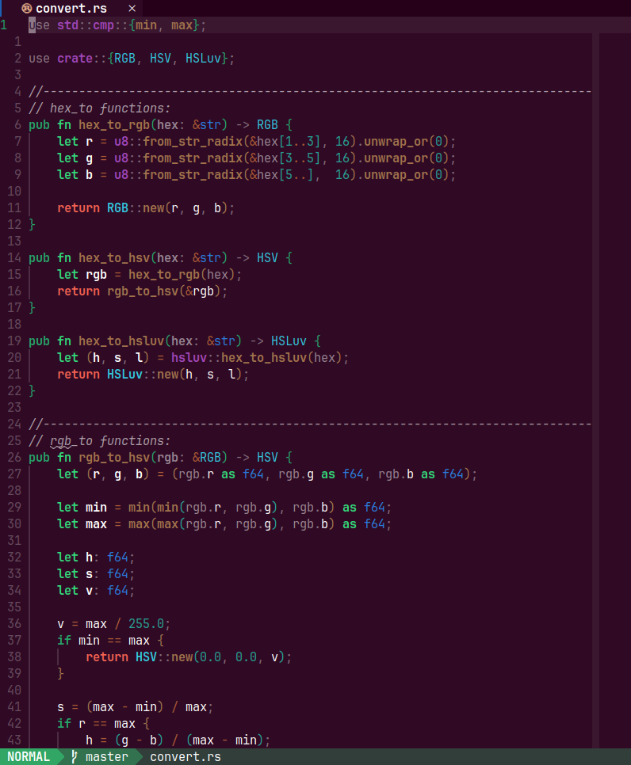

# Nova CS

You want to make **neovim** use your own colors but creating an entire color
scheme is too much? Nova CS is the solution! Specify only 14 main colors and
nova cs will calculate all the different color shades based on them.

Nova cs automatically creates lua table as a separate file.

## Usage

Your palette should be written in the alacritty theme format as a toml file.

Here's an example of a correct theme (breeze theme):

```toml
[colors.bright]
black      =  "#7f8c8d"
blue       =  "#3daee9"
cyan       =  "#16a085"
green      =  "#1cdc9a"
magenta    =  "#8e44ad"
red        =  "#c0392b"
white      =  "#ffffff"
yellow     =  "#fdbc4b"

[colors.normal]
black      =  "#232627"
blue       =  "#1d99f3"
cyan       =  "#1abc9c"
green      =  "#11d116"
magenta    =  "#9b59b6"
red        =  "#ed1515"
white      =  "#fcfcfc"
yellow     =  "#f67400"

[colors.primary]
background =  "#232627"
foreground =  "#ffffff"
```

To create the nova cs palette, run this command:

```bash
$ nova_cs -i {INPUT_FILE} -o {OUTPUT_FILE}
```

where `{INPUT_FILE}` is the input file name, `{OUTPUT_FILE}` is the output file name. For example:

```bash
$ nova_cs -i breeze.toml -o breeze.lua
```

## Compiling

To compile run this:

```bash
$ cargo run --release
```

## Examples

Here are screenshots of neovim using
[nova_cs_example_theme](https://github.com/alacritty/alacritty-theme) and
different palettes:

### Breeze:

### Darktooth:

### Everforest:

### Ubuntu:

### Wombat:


## TODO

Here's what is planned to be implemented:

1. Allowing various common terminal color scheme formats (currently only
   alacritty format supported).
1. Supporting different output formats (currently only lua format for neovim is
   supported).
1. Better support for light themes.

## P.S.

Black and white colors are ignored because there is barely any useful
assumption that can be made about them. Is black same as background? Or
lighter? Or is it even black (some light themes use white for 'black'). Black and
white cannot really be used reasonably in a color scheme, so they are ignored.
